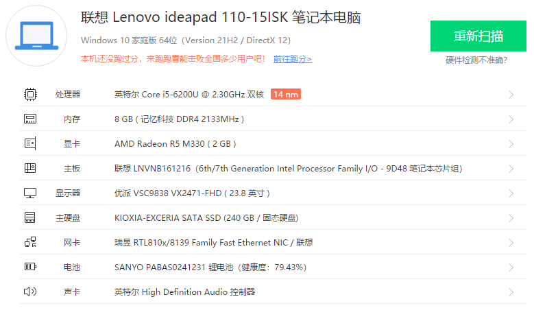

**声明**：
1. 该仓库所提供之 EFI 文件皆收集自互联网，任何人均可出于学习或教育等非盈利目的使用；
2. 由于使用该仓库之 EFI 文件带来的损失由使用者本人完全承担；
3. 使用该仓库之 EFI 文件的行为即视为已阅读并同意前述两条声明。

**注意：使用前务必修改三码，否则 Apple ID 有一定的风险被封。**

Update 20220317

1. 适用于 10.14.6 系统的 EFI 文件已经可以驱动板载 Wi-Fi 和蓝牙，但蓝牙不能被关闭；
2. 适用于 12.1 系统的 EFI 文件各项驱动正常。

日常使用发现 WiFi 和蓝牙存在互相干扰的情况，初步推测是由于 Intel WiFi 驱动的问题。So，只能等作者修了。建议使用 USB 网卡。
